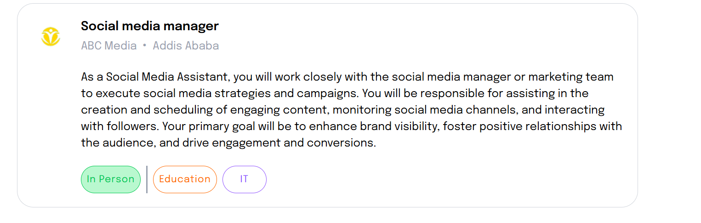
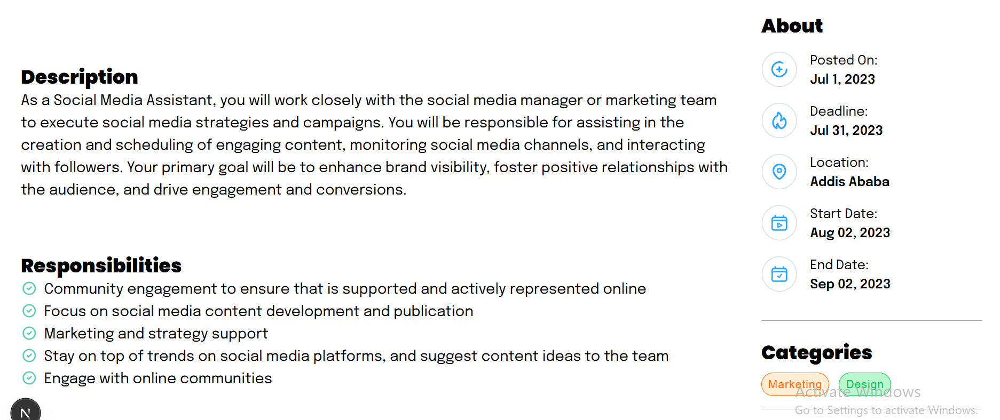
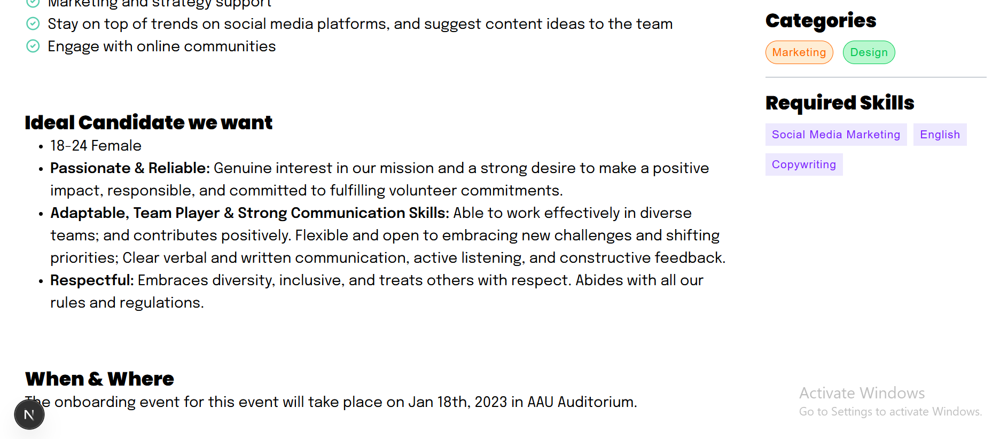

# Job Listing Application

A modern job listing dashboard built with **Next.js** and **Tailwind CSS** as part of the A2SV Web Track Task Series. This project demonstrates component-based UI development, data handling, and styling based on a Figma design.

**Repository:** [https://github.com/ygyesus/a2sv-web-track-task-series.git](https://github.com/ygyesus/a2sv-web-track-task-series.git)

---

## Table of Contents

- [Overview](#overview)
- [Features](#features)
- [Screenshots](#screenshots)
- [How to Run](#how-to-run)
- [Project Structure](#project-structure)
- [Implementation Details](#implementation-details)
---

## Overview

This project is **Task 6** in the A2SV Web Track series. The goal is to build a job listing application with a visually appealing job card and a detailed dashboard for applicants, using dummy data and an avatar image. The UI closely follows a provided Figma file.

---

## Features

- **Job Card Component:** Displays job title, company, location, description, and avatar image.
- **Applicants Dashboard:** Shows job description, responsibilities, ideal candidate, when & where, about, categories, and required skills.
- **Dummy Data:** Populated from `app/jobs.json`.
- **Avatar Image:** Uses `public/job1.png` as the company avatar.
- **Tailwind CSS Styling:** All components are styled to match the Figma design.
- **Component-based Architecture:** Each dashboard section is a separate React component.
- **Screenshots:** Visual documentation of every page/section.

---

## Screenshots

### 1. Job Card



*Shows the job card with avatar, job title, company, location, and description.*

---

### 2. Description, Responsibilities, About, Categories



*Displays the dashboard with job description, responsibilities, about section (dates, location), and job categories.*

---

### 3. Ideal Candidate, When & Where, Required Skills



*Shows the ideal candidate profile, event details (when & where), and required skills for the job.*

---

## How to Run

1. **Clone the repository:**
   ```bash
   git clone https://github.com/ygyesus/a2sv-web-track-task-series.git
   cd a2sv-web-track-task-series
   ```

2. **Install dependencies:**
   ```bash
   npm install
   ```

3. **Start the development server:**
   ```bash
   npm run dev
   ```

4. **Open your browser:**
   Go to [http://localhost:3000](http://localhost:3000) to view the application.

---

## Project Structure

```
a2sv-web-track-task-series/
├── app/
│   ├── components/
│   │   ├── About.tsx
│   │   ├── AboutSection.tsx
│   │   ├── Categories.tsx
│   │   ├── Dashboard.tsx
│   │   ├── Description.tsx
│   │   ├── IdealCandidate.tsx
│   │   ├── JobCard.tsx
│   │   ├── RequiredSkills.tsx
│   │   ├── Responsibilities.tsx
│   │   ├── VerticalDivider.tsx
│   │   ├── WhenAndWhere.tsx
│   │   ├── tags/
│   │   │   ├── Design.tsx
│   │   │   ├── Education.tsx
│   │   │   ├── InPerson.tsx
│   │   │   ├── IT.tsx
│   │   │   ├── Marketing.tsx
│   │   │   └── Tag.tsx
│   │   └── svg/
│   │       ├── CircularTick.tsx
│   │       ├── Deadline.tsx
│   │       ├── EndDate.tsx
│   │       ├── Location.tsx
│   │       ├── PostedOn.tsx
│   │       └── StartDate.tsx
│   ├── jobs.json
│   ├── layout.tsx
│   ├── globals.css
│   ├── page.tsx
│   └── types/
│       └── JobCardProps.tsx
├── public/
│   └── job1.png
└── screenshots/
    ├── job-card.png
    ├── description-responsibilities-about-categories.png
    └── idealCandidate-whenAndWhere-requiredSkills.png

```

---

## Implementation Details

- **Data Handling:**  
  Job data is loaded from `app/jobs.json` and passed as props to components.

- **Props Structure:**  
  The `JobCardProps` TypeScript interface defines the shape of job data.

- **Styling:**  
  All UI is styled with Tailwind CSS, matching the Figma reference.

- **Avatar Image:**  
  The avatar is displayed using the `logoLink` property from the job data, referencing `public/job1.png`.

- **Componentization:**  
  Each dashboard section is a separate, reusable React component for clarity and maintainability.