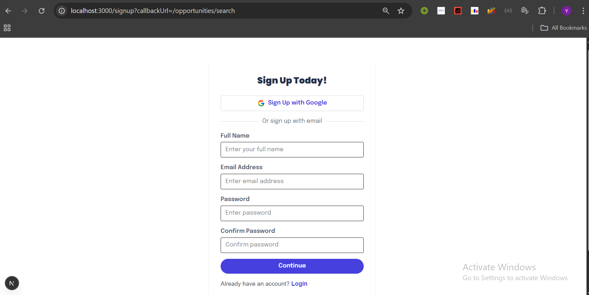
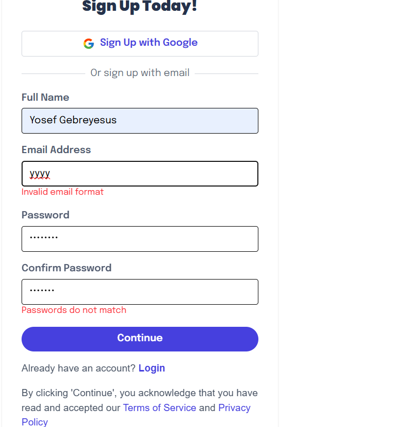
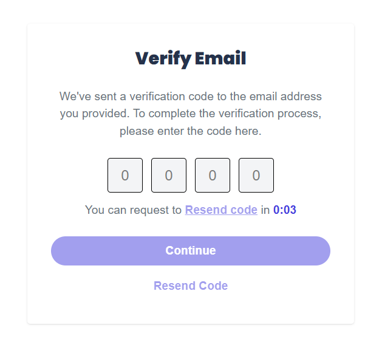
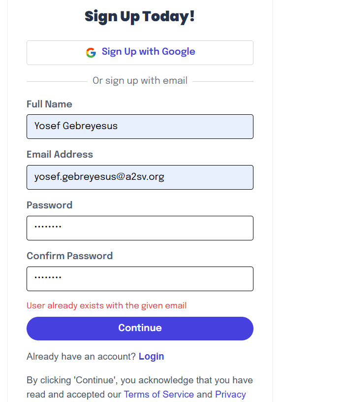
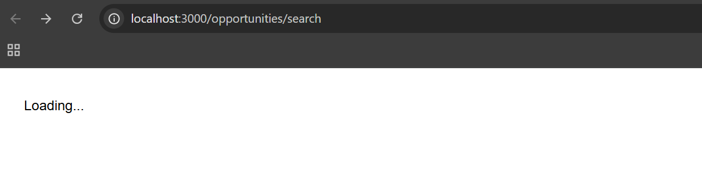
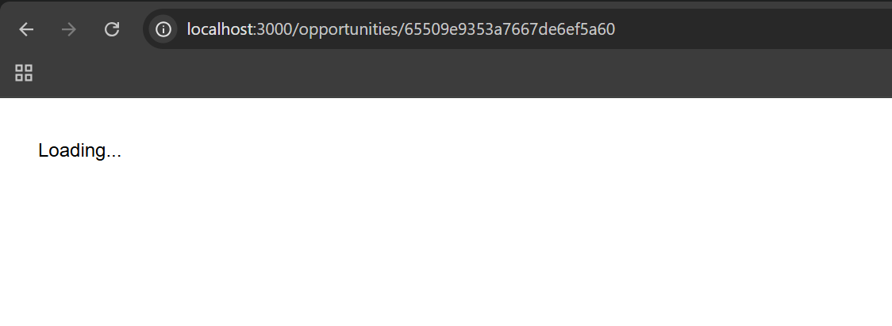
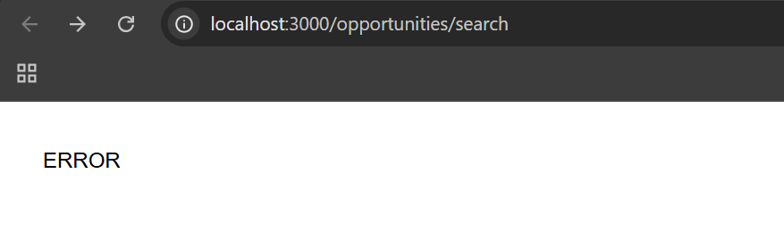
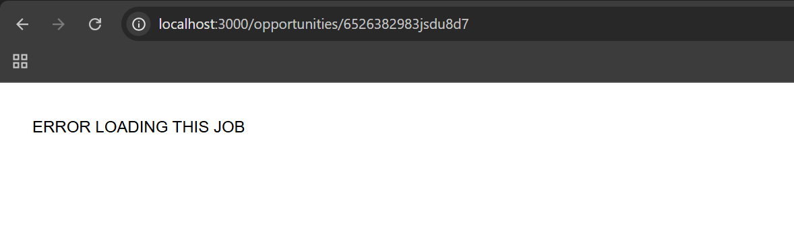

# Job Opportunities Application

---

## 🛡️ Authentication Flow (NextAuth, Custom API, Google OAuth)

This project features a robust authentication system using NextAuth, custom API endpoints, and Google OAuth. Below are screenshots and descriptions of the authentication flow:

### 0. Automatic Redirect to Sign Up if Not Signed In


*If a user tries to access a protected route without being signed in, they are automatically redirected to the sign up page.*

### 1. Sign Up Page with Validation


*The sign up page validates user input and displays errors for invalid or missing fields. Google sign up is also supported.*

### 2. Email Verification


*After signing up, users must enter a 4-digit code sent to their email to verify their account. The UI includes a countdown and resend code option.*

### 3. Error: User Already Exists


*If a user tries to sign up with an email that already exists, a clear error message is shown.*

---

## Table of Contents

- [Overview](#overview)
- [Features](#features)
- [Screenshots](#screenshots)
- [API Integration](#api-integration)
- [How to Run](#how-to-run)
- [Project Structure](#project-structure)
- [Implementation Details](#implementation-details)
- [Technical Stack](#technical-stack)
---

## Overview

The goal of this project is to integrate data from a provided API endpoint into the application and populate job cards with fetched data. The application features dynamic routing, real-time data fetching, and a comprehensive job details dashboard.


---

## Features

### Core Features
- **Dynamic Job Cards:** Display real job opportunities fetched from API
- **Dynamic Routing:** Click on any job card to view detailed information
- **API Integration:** Real-time data from Akil Backend API
- **Error Handling:** Graceful error handling for failed API requests
- **Loading States:** User-friendly loading indicators
- **Responsive Design:** Modern UI with Tailwind CSS

### Job Card Features
- **Company Logo:** Dynamic company logos from API
- **Job Title & Company:** Real job information
- **Location:** Dynamic location data
- **Description:** Detailed job descriptions
- **Dynamic Tags:** Categories and opportunity types (In Person/Virtual)
- **Interactive Design:** Clickable cards for detailed view

### Job Details Dashboard
- **Comprehensive Information:** Full job details including responsibilities, ideal candidate profile
- **Event Details:** When and where information
- **Required Skills:** Dynamic skill requirements
- **About Section:** Posted date, deadline, location, start/end dates
- **Categories:** Job categories and tags

---

## Screenshots

### 1. Job Cards with Dynamic API Data


*Shows multiple job cards populated with real API data, including company logos, job titles, descriptions, and dynamic tags based on opportunity type and categories.*

---

### 2. Dynamic Routing - Job Details Page


*Demonstrates the dynamic routing functionality where clicking on a job card navigates to a detailed view with comprehensive job information.*

---

### 3. Loading States - Job Listings Page



*Shows the loading state when fetching job opportunities from the API, providing user feedback during data retrieval.*

---

### 4. Loading States - Individual Job Details



*Displays the loading state when fetching specific job details, ensuring users know the application is working on their request.*

---

### 5. Error Handling - Job Listings Page



*Demonstrates graceful error handling when the API request for job listings fails, showing user-friendly error messages.*

---

### 6. Error Handling - Individual Job Details



*Shows error handling for individual job detail requests, ensuring the application remains stable even when API calls fail.*

---

## API Integration

### API Endpoint
- **Base URL:** `https://akil-backend.onrender.com`
- **Documentation:** [API Documentation](https://documenter.getpostman.com/view/27955515/2sA3rwMEUX)

### Endpoints Used
- **GET `/opportunities/search`** - Fetch all job opportunities
- **GET `/opportunities/:id`** - Fetch specific job by ID

### Implementation Details
- **Redux Toolkit Query:** Used for efficient data fetching and caching
- **Error Handling:** Graceful handling of failed API requests
- **Loading States:** User-friendly loading indicators
- **Type Safety:** Full TypeScript integration with API response types

### Data Structure
The application handles the following API data structure:
```typescript
interface JobOpportunity {
  id: string;
  title: string;
  description: string;
  orgName: string;
  logoUrl: string;
  location: string;
  opType: "inPerson" | "virtual";
  categories: string[];
  responsibilities: string;
  idealCandidate: object;
  whenAndWhere: string;
  datePosted: string;
  deadline: string;
  startDate: string;
  endDate: string;
  requiredSkills: string[];
}
```

---

## How to Run

1. **Clone the repository:**
   ```bash
   git clone https://github.com/ygyesus/a2sv-web-track-task-series.git
   cd a2sv-web-track-task-series
   ```

2. **Install dependencies:**
   ```bash
   npm install
   ```

3. **Start the development server:**
   ```bash
   npm run dev
   ```

4. **Open your browser:**
   Go to [http://localhost:3000](http://localhost:3000) to view the application.

5. **Navigate to opportunities:**
   Visit [http://localhost:3000/opportunities/search](http://localhost:3000/opportunities/search) to see the job listings.

---

## Project Structure

```
a2sv-web-track-task-series/
├── app/
│   ├── components/
│   │   ├── App.tsx                 # Main application component
│   │   ├── JobCard.tsx             # Individual job card component
│   │   ├── Dashboard.tsx           # Job details dashboard
│   │   ├── About.tsx               # About section component
│   │   ├── Categories.tsx          # Job categories component
│   │   ├── Description.tsx         # Job description component
│   │   ├── IdealCandidate.tsx      # Ideal candidate section
│   │   ├── RequiredSkills.tsx      # Required skills component
│   │   ├── Responsibilities.tsx    # Job responsibilities component
│   │   ├── WhenAndWhere.tsx       # Event details component
│   │   ├── VerticalDivider.tsx    # UI divider component
│   │   ├── tags/
│   │   │   ├── Tag.tsx            # Dynamic tag component
│   │   │   └── [other tag components]
│   │   └── svg/
│   │       └── [SVG icon components]
│   ├── opportunities/
│   │   ├── search/
│   │   │   └── page.tsx           # Job listings page
│   │   └── [opportunityId]/
│   │       ├── page.tsx           # Dynamic route page
│   │       └── Job.tsx            # Job details component
│   ├── service/
│   │   ├── opportunities.ts       # API service with RTK Query
│   │   └── ReduxProvider.tsx      # Redux provider component
│   ├── types/
│   │   └── JobCardProps.tsx       # TypeScript interfaces
│   ├── layout.tsx                 # Root layout component
│   └── globals.css               # Global styles
├── lib/
│   └── store.ts                  # Redux store configuration
├── public/
│   └── [static assets]
└── screenshots/
    ├── job-card-with-tags-based-on-api-data.png
    └── click-inside-job-card-to-find-dynamic-route-for-the-job.png
```

---

## Implementation Details

### API Integration
- **Redux Toolkit Query:** Implemented for efficient data fetching with automatic caching
- **Error Handling:** Comprehensive error handling for network failures and invalid responses
- **Loading States:** User-friendly loading indicators during data fetching
- **Type Safety:** Full TypeScript integration ensuring type safety

### Dynamic Routing
- **Next.js App Router:** Utilized for dynamic route generation
- **Dynamic Segments:** `[opportunityId]` for individual job pages
- **SEO Optimized:** Server-side rendering for better performance

### Component Architecture
- **Modular Design:** Each feature is a separate, reusable component
- **Props Interface:** Well-defined TypeScript interfaces for type safety
- **Conditional Rendering:** Dynamic content based on API data

### State Management
- **Redux Toolkit:** Centralized state management
- **RTK Query:** Automatic caching and background updates
- **Optimistic Updates:** Smooth user experience with immediate UI updates

### Styling
- **Tailwind CSS:** Utility-first CSS framework
- **Responsive Design:** Mobile-first approach
- **Custom Components:** Reusable styled components
- **Dynamic Styling:** Tags and elements styled based on content

---

## Technical Stack

- **Framework:** Next.js 14 with App Router
- **Language:** TypeScript
- **Styling:** Tailwind CSS
- **State Management:** Redux Toolkit + RTK Query
- **API Integration:** REST API with fetch
- **Routing:** Next.js Dynamic Routes
- **Development:** ESLint, PostCSS

### Key Dependencies
- `@reduxjs/toolkit` - State management
- `react-redux` - React bindings for Redux
- `next` - React framework
- `tailwindcss` - CSS framework
- `typescript` - Type safety


